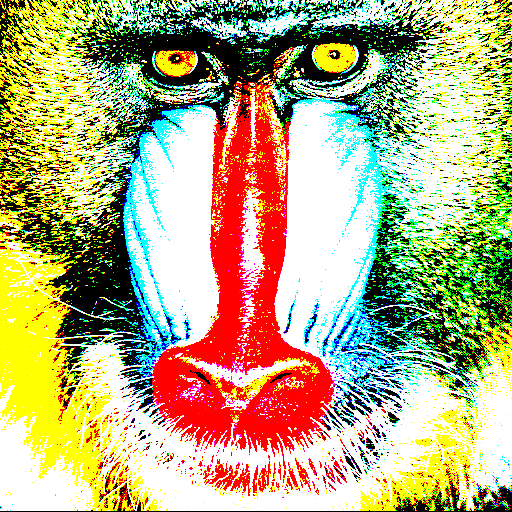

# Image Processing with Python

## Overview
This project implements various image processing filters using convolution techniques in Python. It provides a collection of predefined kernels and allows users to apply different filters to images, including Sobel edge detection, Gaussian blur, motion blur, and custom kernels.

## Features
- Multiple predefined image filters:
  - Basic operations (Thresholding, Identity, Negative)
  - Edge detection (Sobel Vertical and Horizontal)
  - Sharpening filters (Sharpen, Unsharpen)
  - Blur effects (Gaussian 5x5, Box Blur 11x11, Lens Blur 11x11, Motion Blur 11x11)
- Custom kernel support
- Image padding with border handling
- Normalization of processed images
- Support for both grayscale and RGB images

## Project Structure
- `Archivo1.py`: Contains kernel definitions and basic image operations
- `Archivo2.py`: Implements core functionality (padding, convolution, normalization)
- `Archivo3.py`: Main program interface and user interaction

## Requirements
- Python 3.x
- NumPy
- Pillow (PIL)

## Installation
1. Clone this repository:
```bash
git clone https://github.com/yourusername/image-processing.git
cd image-processing
```

2. Install required packages:
```bash
pip install numpy Pillow
```

## Usage
1. Place your input images in the `test_images` directory
2. Run the main program:
```bash
python Archivo3.py
```
3. Follow the interactive prompts:
   - Enter the image filename
   - Select a filter operation (1-12)
   - For thresholding, enter a threshold value
   - For custom kernels, specify size and values
   - Enter output filename

## Available Operations
1. Thresholding
2. Identity
3. Negative
4. Sobel Vertical
5. Sobel Horizontal
6. Sharpen
7. Gaussian (5x5)
8. Unsharpen (5x5)
9. Box Blur (11x11)
10. Lens Blur (11x11)
11. Motion Blur (11x11)
12. Custom Kernel

## Technical Details
- Implements proper padding techniques for convolution operations
- Handles both grayscale and RGB images
- Normalizes output to ensure valid pixel values (0-255)
- Uses NumPy for efficient array operations
- Implements border handling for convolution operations

## Examples

### Example Usage
Here's an example of using the thresholding filter (Operation 1) with a threshold value of 100:

```bash
Ingrese el nombre de la imagen: baboon.png

OPERACIONES
-----------
1. Umbralizar
2. Identidad
3. Negativo
4. Sobel vertical
5. Sobel horizontal
6. Sharpen
7. Gaussian
8. Unsharpen
9. Box blur
10. Lens blur
11. Motion blur
12. Kernel personalizado

Ingrese número de la operación: 1
Ingrese un umbral: 100
Ingrese el nombre de salida de la imagen: baboon_editado.png

Operacion realizada con exito!
```

### Results
Here's a visual example of applying the thresholding filter to an image:

Original Image | Thresholded Image (threshold = 100)
:-------------------------:|:-------------------------:
 | 

## Future Improvements
- Add batch processing capabilities
- Implement more advanced filters
- Add support for different image formats
- Create a graphical user interface
- Optimize convolution operations for better performance

## Contributing
Feel free to fork this repository and submit pull requests. You can also open issues for bugs or feature requests.

## License
This project is open source and available under the MIT License.
